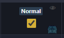

# WeeklyTrackerLA – Releases

This repository hosts the Windows installers for WeeklyTrackerLA (no source code). Use this page to download, install, and verify the app.

## 📥 Download (Windows x64)

- Installer: https://github.com/RaimundoMedeiros/WeeklyTrackerLA-Releases/releases/latest
- Signature (.sig): available in the same release
- Integrity (latest SHA256): D50ACE7C67903939BA6184D1DEC3F8562A6384A3B4AEB75A51B7693296047CA2
- Requirements: Windows 10/11 x64

## 🚀 Quick start
1. Download the installer from the latest release.
2. Run the `.exe` and complete the setup wizard.
3. Open the app; the built-in updater will check for new versions automatically.

## 🕹️ How to use
1) Add characters (choose one):
   - Import from LOA Logs database (encounters.db) via the first-run modal, or
   - Import from Mathi.Moe API (needs one character name), or
   - Add manually.
2) Configure database path (recommended for auto-import): Settings → Database Path. Typical location: `C:\Users\<YourUsername>\AppData\Local\LOA Logs\encounters.db`.
3) Weekly tab: mark raids, set difficulty, chest, and optional gold.
4) Progression tab: set current gear and target; view optimal upgrade routes.
5) Resets: weekly (Wed 08:00 UTC) and daily apply automatically; reopen the app after reset if it was closed.

### Raid cell controls

- Eye icon: hides this raid from the character’s gold total (and from view).
- Chest icon: toggles chest; subtracts the chest cost/value from the character’s total gold.
- Difficulty badge (Solo/Normal/Hard): click to cycle difficulty for that raid.
- Hover on the checkmark (when loaded from LOA Logs): shows the date/time you cleared that raid/guardian raid.

### Weekly tracker buttons

- Gear icon: choose which columns/raids are visible.
- Load Data: pull raid data from the LOA Logs database (encounters.db) if configured.
- Reset Data: clear all saved data (roster/progress). Use with caution.

### Roster selector controls

- Dropdown: pick the active roster to display.
- Eye icon: choose which rosters to show side-by-side on the same tab.
- Plus (+): create a new roster.
- "Aa": rename the selected roster.
- Trash: delete the selected roster.

## ✨ What the app does
- Roster management and per-roster visibility
- Weekly raid tracking (difficulty, chest, gold)
- T4 progression calculator and route optimizer(WIP)
- Auto weekly and daily reset handling
- Optional LOA Logs import
- Auto-update via GitHub Releases with signature check

## 🧭 Known issues
- Chaos Gate and Field Boss additions to the database can be inconsistent; no short-term fix.

## ❓ FAQ
- **Where is my data stored?** Locally in the app data folder (userData.json). Updates do not wipe it.
- **Do I need an account?** No. Everything is offline/local.
- **Can I run multiple rosters?** Yes, manage visibility per roster.

## 🆘 Support
- send me a message in discord if you find any problem: mediun.
